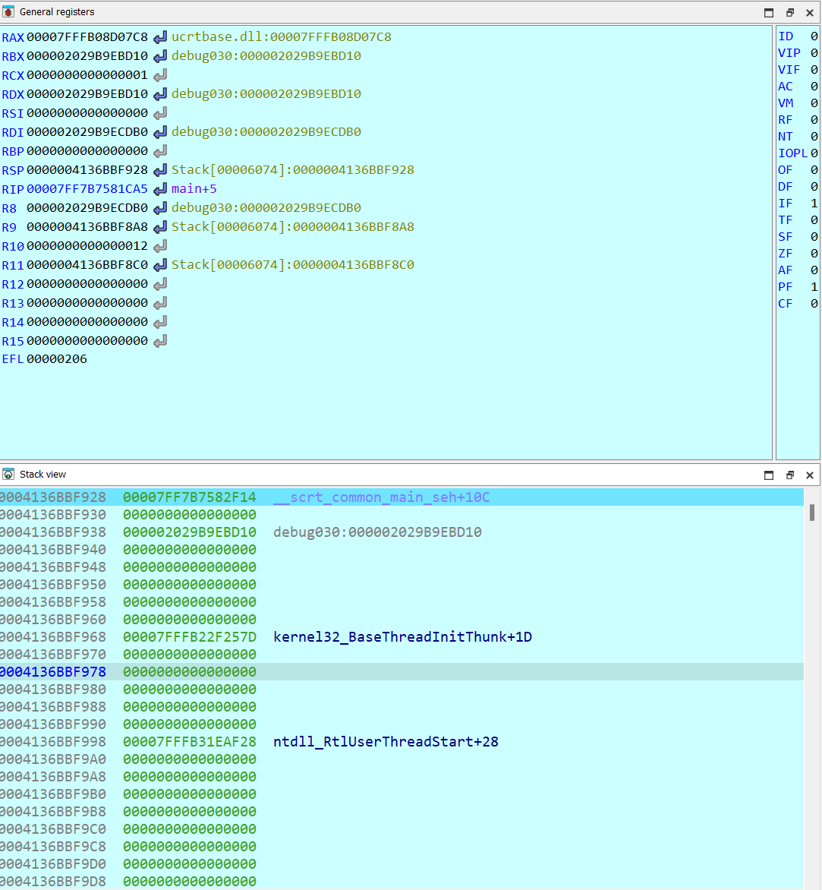
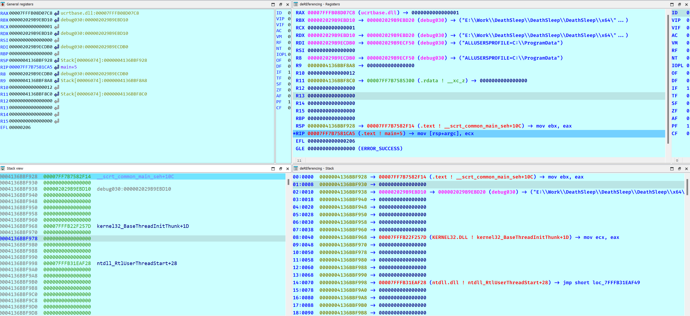
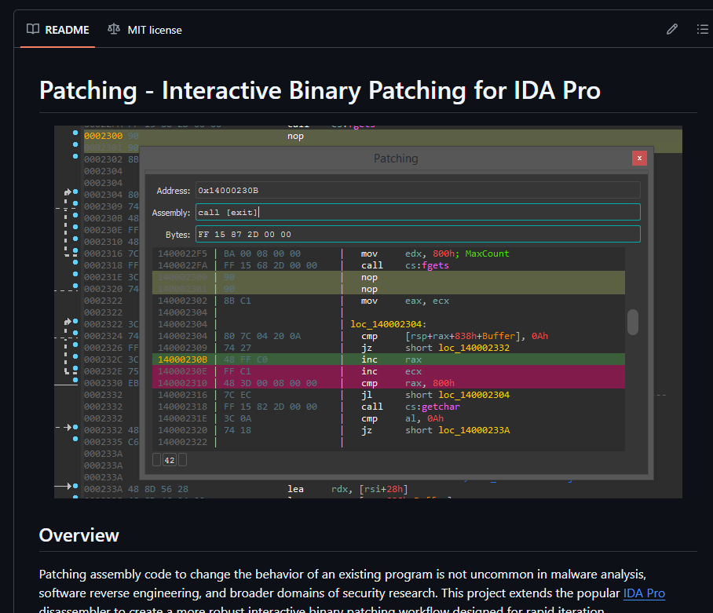
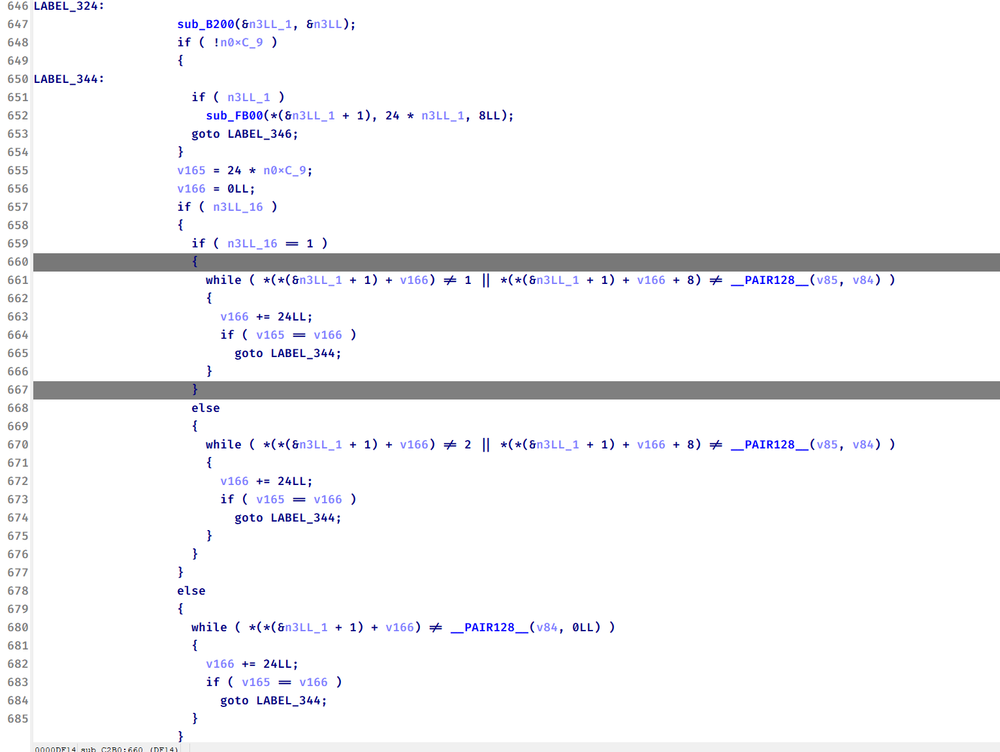
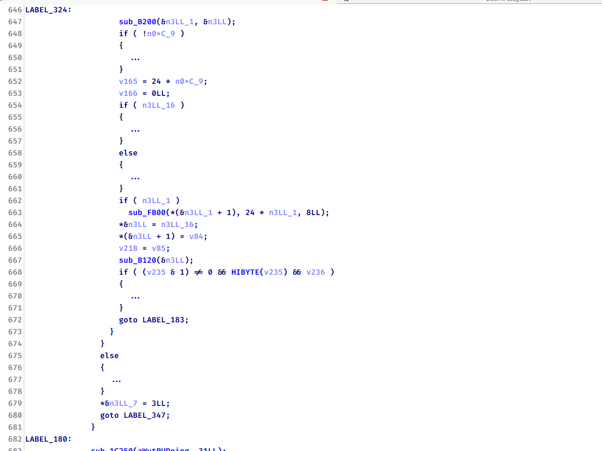
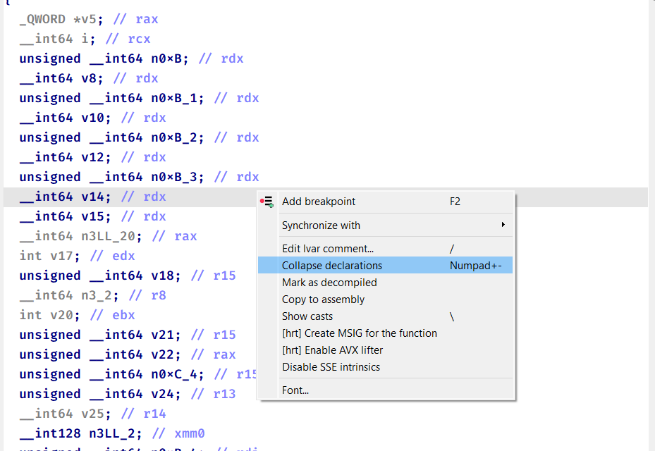
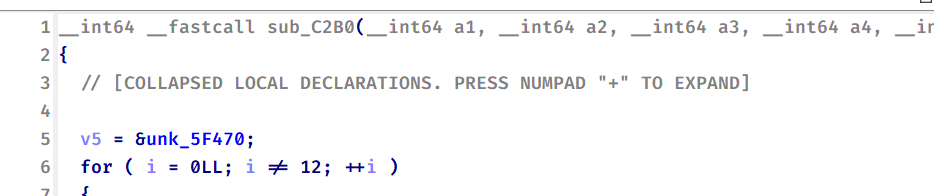

## 21/04/2026

Hehe bài blog đầu tiên, phân vân không biết nên phải viết gì, thôi thì bắt đầu với việc sharing 1 chút những thứ xoay quanh bản thân vậy :v.

Chủ đề lần này như mọi người thấy ở tiêu đề bên ngoài. Lý do là, 'thiz' m l1f3 dis4ssembler'.

Bất kể là cái dissasembler nào, không có 1 bộ kit ngon thì con đường sẽ trắc trở vô cùng. Để mà so sánh thì dùng ida không plugin chắc cũng như code trên vscode mà không cài extension nào vậy :)). Và càng tiện ích thì ta càng công muốn động đến những thứ thiếu tính năng như VIM hay Ghira.

Tất nhiên là mình không phải kiểu người thích tự làm khó bản thân. Từ những bước đầu tiên trên từng dòng instruction, mình trang bị dần những plugin cơ bản nhất như `patching`, `yara-findcrypt`, `dereferencing` cho đến những công cụ cá nhân hóa để tự làm hài lòng chính quá trình debug của mình như `ida scyllahide`, `REnew`...

Dưới đây mình sẽ điểm qua những plugin từ cần thiết nhất đến những plugin mình tự xây dựng trong quá trình sử dụng IDA. Có thể có thứ hữu dụng với mình nhưng lại vô dụng với người khác, hi vọng ae thấy được thứ gì hay ho để thêm vào folder plugin của chính mình :v

#### IDA-MCP

Nguồn: https://github.com/mrexodia/ida-pro-mcp

Ờ thì, chắc không còn gì để cạnh tranh được ngôi vị số 1 của plugin này. Dưới sự phát triển của AI mà vẫn còn rev chay thì hơi đúng là hơi "bot".

Không nói đến việc cầm MCP ptmd nhàn hơn cỡ nào, hiện tại các cuộc thi CTF cũng đang bị thống trị bởi AI. Với mcp, AI đọc code quá nhanh khiến những challenge khó về mặt độ dài dần mất đi giá trị. Điều này khiến người ra đề có xu hướng tạo ra những challenge dài hơn nhằm đánh đố AI chứ không phải con người nữa. Không dùng thì thua, mà dùng thì không gain được gì cả vì thứ AI trả lại mình chỉ là cái flag :)).

Tuy vậy mcp cũng không phải vạn năng, mình thấy AI dù đọc code nhanh đến đâu vẫn không tư duy tốt bằng mình(mình nói câu này không phải dưới quan điểm của 1 newbie), nên ở những vấn đề phức tạp hơn ví như deobf chẳng hạn, thường vẫn là tự mình phải tìm ra hướng giải quyết rồi giao cho AI ý tưởng để hoàn thành.

Và mình cũng không đủ token để cầm mcp 1 shot một mẫu mã độc như chơi ctf, nên cũng dùng tiết kiệm để không rơi vào hoàn cảnh này(hiện tại thì xài AI lậu như đăng kí st36k rồi).

Vậy nên enjoy thôi, những thứ AI có thể 1 shot được cũng chẳng đáng để mình làm, thứ mà mình hướng đến hiện tại là những bài toán thực sự khó. Focus vào tư duy giải quyết, coding và những việc lặt vặt thì lọ AI là được.

Luyên thuyên vậy rồi tóm lại là MCP làm được những gì? thứ mcp hỗ trợ được nhiều nhất đấy là đọc code và phân tích tĩnh. Như đã nói ở trên rằng AI đọc code cực nhanh-> tóm tắt luồng chương trình, ý đồ và chỉ ra được những thứ được giấu ở tít trong những cái wraper tận đâu đó của chương trình. Mình thấy giúp cải thiện tốc độ và độ chính xác khá nhiều. Tóm lại là một plugin không thể thiếu.

#### htrng

Nguồn: https://github.com/KasperskyLab/hrtng

Nếu không phải là cái plugin mcp không thể không dùng thì chắc chắn cái này là plugin số 1. Tiếc là thời thế thay đổi~

Về tính năng thì như ảnh dưới đây là 1 nửa tính năng của nó, quá nhiều. Trong repo của họ từng chức năng đều có video PoC của tính năng đó.

Nhưng tóm tắt lại những thứ quan trọng nhất nó mang lại là deobf cơ bản `CFF`, deobf `MBA`, collapse code, hỗ trợ analize bằng cách auto cmt string trong const, auto rename,...Cùng với vô vàn tính năng khác mà mình còn chưa tìm hiểu hết hoặc đang dùng mà không nhớ ra.

Mặc dù toàn diện là vậy, nhưng vẫn có chỗ không đủ tốt. Ví như cái chức năng deobf CFF, chỉ có thể deobf cơ bản, có khi còn mất 1 phần code. Hay như cái deobf MBA lại chỉ deobf với biến thông thường, những biểu thức chèn var là 1 hàm thì lại chịu chết :)))

#### dereferencing

Nguồn: https://github.com/danigargu/deREferencing

Con hàng này cũng quan trọng không kém, giúp mình tăng tốc độ debug khá nhanh, mà đỡ bị ức chế khi quan sát cửa sổ thanh ghi hơn nhiều.

Thời còn chân ướt chân ráo bước vào con đường này, debugger đầu tiên mình sử dụng không phải IDA mà là gdb :v. Giai đoạn đầu khá chật vật khi không có mã giả từ IDA, Nhưng sau khi bỏ gdb chuyển sang chỉ dùng IDA thì mỗi lần nhìn vào cửa sổ reg và stack lại thấy thiếu thiếu gì đó.

Trông đơn sơ vcl chứ thiếu. Cơ bản là giờ IDA 9.0/9.1 cũng đỡ hơn rồi, hồi còn là IDA 7.7 còn tộc hơn, muốn trace theo địa chỉ cứ phải bấm bấm mệt vcc. Trong khi thanh ghi lưu địa chỉ thì gbd show luôn giá trị trong địa chỉ ở dòng đấy, nên khi review code khá nhanh, mình đỡ phải bấm vào.

Và `dereferencing` có thể giải quyết vấn đề trên.

Trông dễ nhìn hẳn, những string được trỏ vào hiện rõ ra, biết được cái gì được đẩy vào thanh ghi, stack.

#### patching

Nguồn: https://github.com/gaasedelen/patching

Tất nhiên không phải là vì ida không thể patch, nhưng chức năng patch của ida hơi tộc, cái này vừa giao diện đẹp, vừa dễ dùng lại patch được nhiều ins.

Nhưng khi patch vẫn không tránh khỏi 1 vài vấn đề, khi patch thành `jump`,... à thôi, có thể tự cài và trải nghiệm :v

#### Aphrodite

Nguồn: https://github.com/leommxj/AphroditeF5

Con hàng này khá thực dụng, mặc dù htrng cũng có chức năng tương tự nhưng rườm rà và không đúng ý của mình lắm, đơn giản là để thu gọn phần code trong cặp ngoặc, giúp mình review code dễ hơn, đỡ ngợp vì dài.

Sau đó sẽ trông như này.

Tuy nhiên hơi ngố chút là mỗi lần F5 hoặc từ hàm con back lại thì những chỗ ẩn đi bằng `Aphrodite` lại bung ra, chắc sau tìm cách nâng cấp. Nếu ai có hứng thú thì có thể tham khảo cách mà tính năng collapse declaration này không bị bung ra khi F5.

#### IDA-Scyllahide

Tham khảo tại https://sonvh2511.github.io/post/?slug=ida-scyllahide

Tự động hóa quá trình inject con dll của scyllahide vào tiến trình hiện tại.

#### IDA renew

Nguồn: https://sonvh2511.github.io/post/?slug=renew

Cái này cũng không có gì :v. Chỉ là trong lúc code trên MVSC, mình có thói quen debug trên ida chứ không debug trên compiler đó. Mà mỗi lần sửa code 1 chút lại phải tắt đi load lại thì khá phiền nên sinh ra tool này :). Đơn giản là tự động hóa quá trình tắt đi bật lại cho đỡ tốn thao tác :v

### Lời kết

Đó là một vài plugin mình thấy hữu ích chia sẻ ra, mỗi plugin đều hữu dụng nhưng vẫn còn hạn chế như đã kể trên, tuy vậy cũng dễ dàng cải thiện. Hi vọng có thể giúp mn tham khảo :v

Không ngờ viết chút chút mà mệt hơn hẳn ngồi viết wu, đến đoạn cuối hết sức đọc lại trông chán hẳn. Hi vọng có thể cải thiện trong những bài sau và duy trì :()
