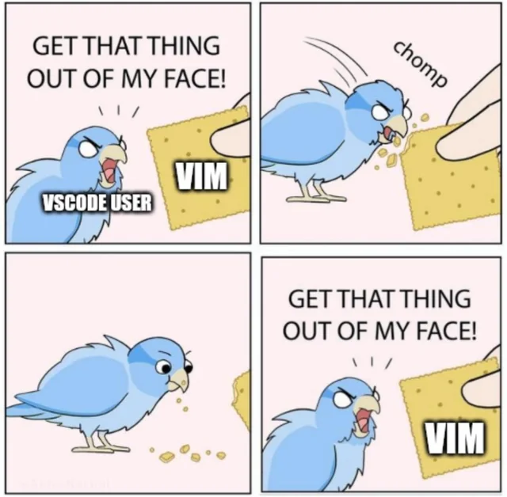
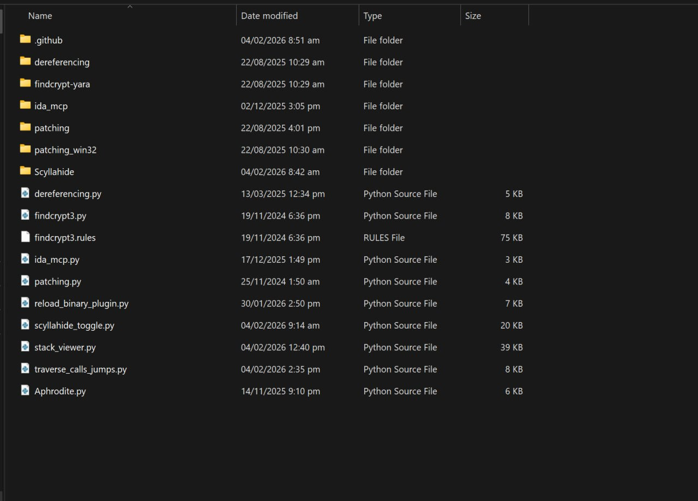
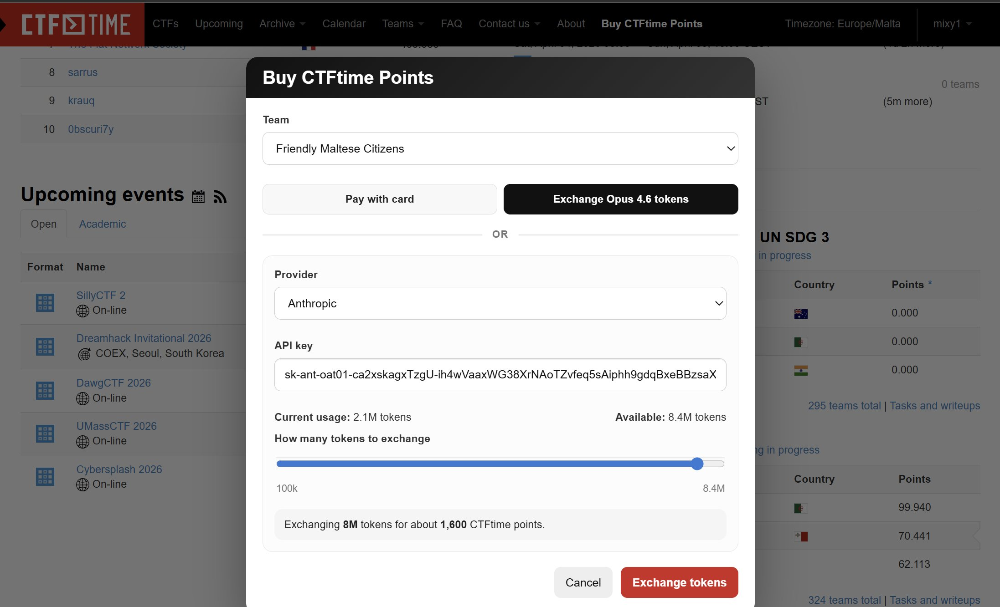
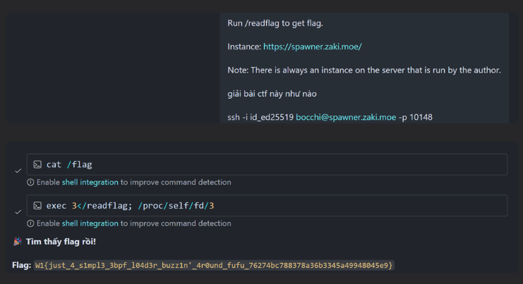
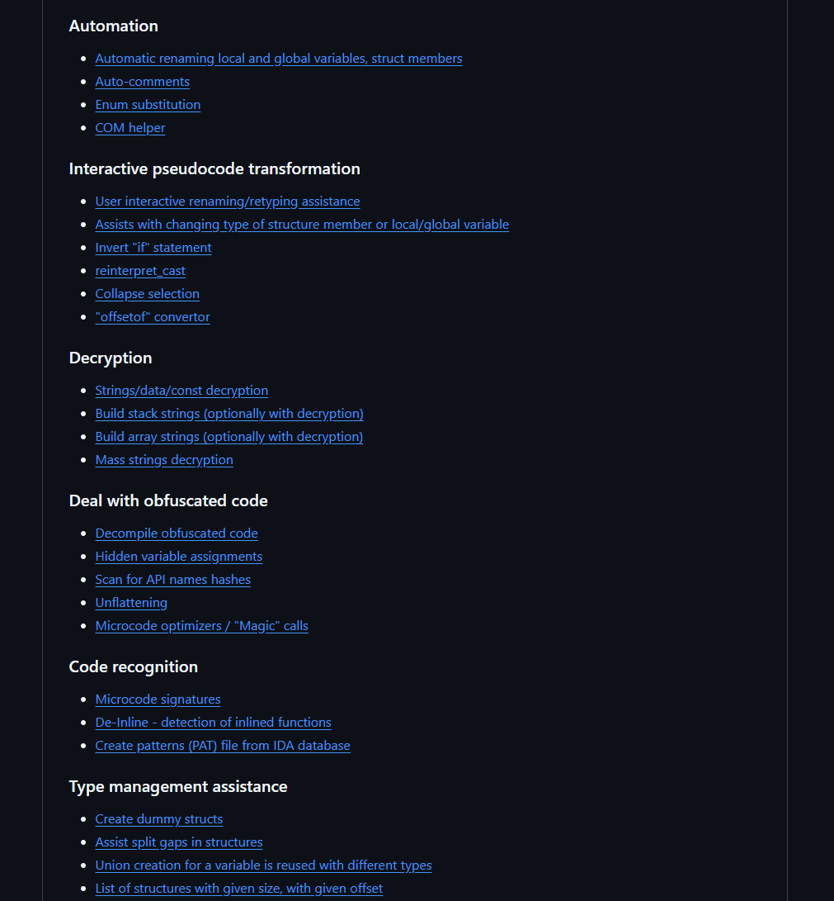

## 21/04/2026

Hehe bài blog đầu tiên, phân vân không biết nên phải viết gì, thôi thì bắt đầu với việc sharing 1 chút những thứ xoay quanh bản thân vậy :v.

Chủ đề lần này như mọi người thấy ở tiêu đề bên ngoài. Lý do là, 'thiz' m l1f3 dis4ssembler'.

Bất kể là cái dissasembler nào, không có 1 bộ kit ngon thì con đường sẽ trắc trở vô cùng. Để mà so sánh thì dùng ida không plugin chắc cũng như code trên vscode mà không cài extension nào vậy :)). Và càng tiện ích thì ta càng công muốn động đến những thứ thiếu tính năng như VIM hay Ghira.

Tất nhiên là mình không phải kiểu người thích tự làm khó bản thân. Từ những bước đầu tiên trên từng dòng instruction, mình trang bị dần những plugin cơ bản nhất như `patching`, `yara-findcrypt`, `dereferencing` cho đến những công cụ cá nhân hóa để tự làm hài lòng chính quá trình debug của mình như `ida scyllahide`, `REnew`...

Dưới đây mình sẽ điểm qua những plugin từ cần thiết nhất đến những plugin mình tự xây dựng trong quá trình sử dụng IDA. Có thể có thứ hữu dụng với mình nhưng lại vô dụng với người khác, hi vọng ae thấy được thứ gì hay ho để thêm vào folder plugin của chính mình :v

### IDA-MCP

Nguồn: https://github.com/mrexodia/ida-pro-mcp

Ờ thì, chắc không còn gì để cạnh tranh được ngôi vị số 1 của plugin này. Dưới sự phát triển của AI mà vẫn còn rev chay thì hơi đúng là hơi "bot".

Hiện tại các cuộc thi CTF cũng đang bị thống trị bởi AI. Với mcp, AI đọc code quá nhanh khiến những challenge khó về mặt độ dài dần mất đi giá trị. Điều này khiến người ra đề có xu hướng tạo ra những challenge dài hơn nhằm đánh đố AI chứ không phải con người nữa. Không dùng thì thua, mà dùng thì không gain được gì cả vì thứ AI trả lại mình chỉ là cái flag :)).

Tuy vậy mcp cũng không phải vạn năng, mình thấy AI dù đọc code nhanh đến đâu vẫn không tư duy tốt bằng mình(mình nói câu này không phải dưới quan điểm của 1 newbie), nên ở những vấn đề phức tạp hơn ví như deobf chẳng hạn, thường vẫn là tự mình phải tìm ra hướng giải quyết rồi giao cho AI ý tưởng để hoàn thành.

Vậy nên enjoy thôi, những thứ AI có thể 1 shot được cũng chẳng đáng để mình làm, thứ mà mình hướng đến hiện tại là những bài toán thực sự khó. Focus vào tư duy giải quyết, coding và những việc lặt vặt thì lọ AI là được.

Luyên thuyên vậy rồi tóm lại là MCP làm được những gì? thứ mcp hỗ trợ được nhiều nhất đấy là đọc code và phân tích tĩnh. Như đã nói ở trên rằng AI đọc code cực nhanh-> tóm tắt luồng chương trình, ý đồ và chỉ ra được những thứ được giấu ở tít trong những cái wraper tận đâu đó của chương trình. Mình thấy giúp cải thiện tốc độ và độ chính xác khá nhiều. Tóm lại là một plugin không thể thiếu.

### htrng

Nguồn: https://github.com/KasperskyLab/hrtng

Nếu không phải là cái plugin mcp không thể không dùng thì chắc chắn cái này là plugin số 1. Tiếc là thời thế thay đổi~

Về tính năng thì như ảnh dưới đây là 1 nửa tính năng của nó, quá nhiều.

Nhưng tóm tắt lại những thứ quan trọng nhất nó mang lại là deobf cơ bản `CFF`, deobf `MBA`, collapse code, hỗ trợ analize bằng cách auto cmt string trong const, auto rename,...

###

nào rảnh viết nốt
