# 20/06/2026

Blog xamlul nhiều quá, làm bài thuần tech đổi gió vậy.

## Deobf Indirectjump

Nghiên cứu deobf indirect jump trên mẫu `PlugX`. Tất nhiên, như mọi khi mình sẽ không đề cập đến việc phân tích hành vi mà đi sâu vào deobf là chính.

> **Indirect jump** là một dạng obfuscate luồng chương trình, sử dụng giá trị trong thanh ghi được tính toán trong quá trình chạy làm địa chỉ đích cho opcode `jmp`/`jcc` thay vì địa chỉ cố định thông thường.

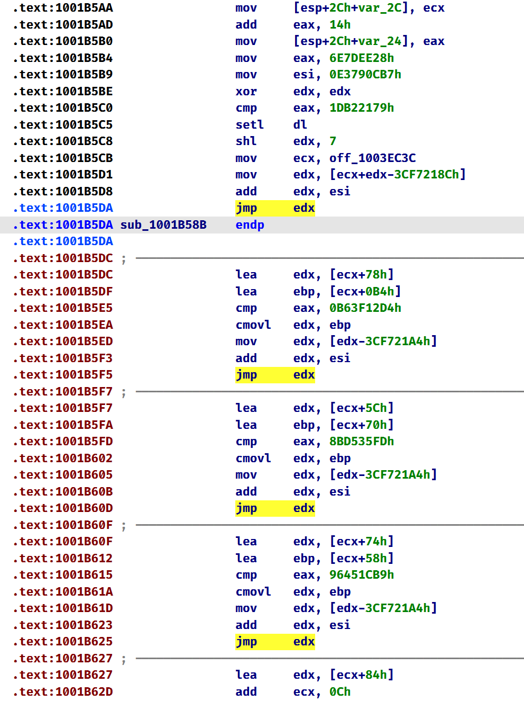

Khái niệm chắc ai cũng rõ rồi. Review cơ bản nó sẽ...Trông như này.

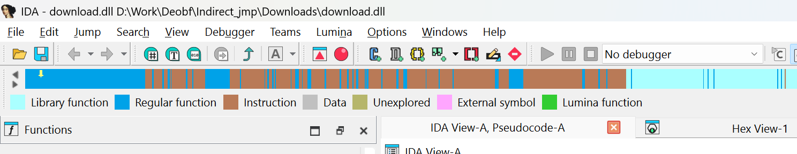

Cụ thể hơn, con này đã được obfuscate indirect jump luồng chương trình sau ollvm CFF. Còn vì sao mình bảo là CFF thì đây là 1 hàm của nó sau khi deobf.

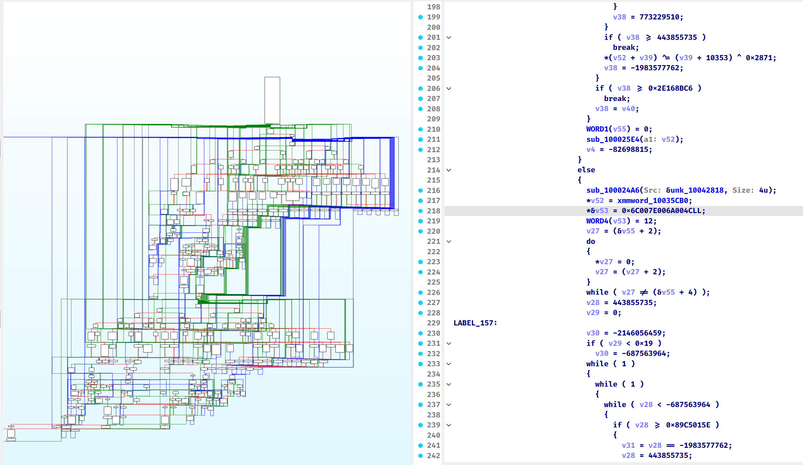

Hoặc cũng có thể nói là chỉ có CFF mới đủ hiệu quả khi chèn thêm indirect jump vậy.

Trước tiên, indirect jump thì cũng có nhiều kiểu, indirect jump trong con `PlugX` này nó sẽ xoay quanh cơ chế sử dụng các phương thức khác nhau để thay đổi giá trị các `EFLAGS` bằng `cmp`/`test`/`sub` và kết hợp với các conditional insns như `setl`/`setnl`/`cmovge`/`cmovz`... nhằm biến một chunk chứa `jcc` thông thường thành dạng biểu thức tính toán địa chỉ được nhảy đến sau cùng.

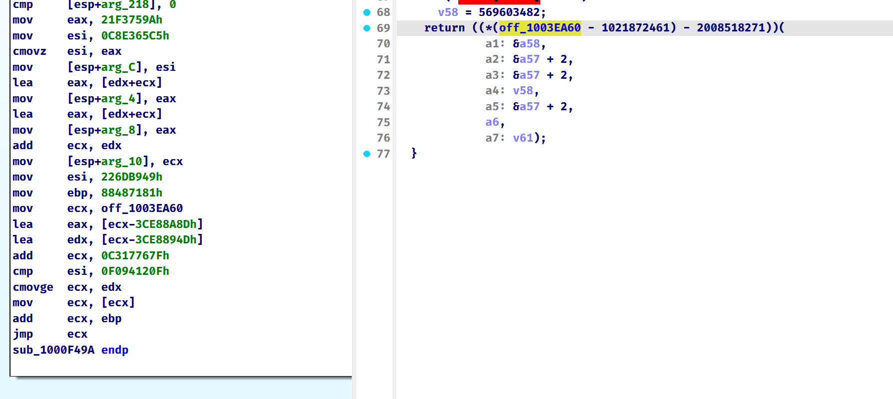

Mình quy định các thành phần bao gồm `TABLE` và `INDEX` với `INDEX` là giá trị được biến đổi phụ thuộc vào các flag mà tính ra các giá trị khác nhau, đây sẽ là thứ ta bám vào và deobf mọi pattern trong chương trình này.

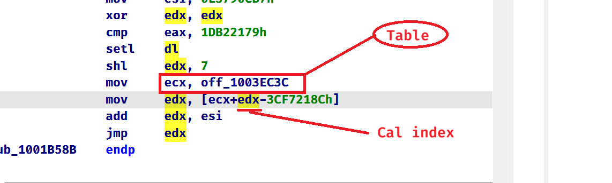

Ở đây mình chia ra thành các pattern khác nhau và xử lý, trên mẫu này mình thấy có 3 pattern chính. Công cụ sử dụng để deobf tất nhiên là `IDApython` và `Unicorn`.

### Pattern cơ bản

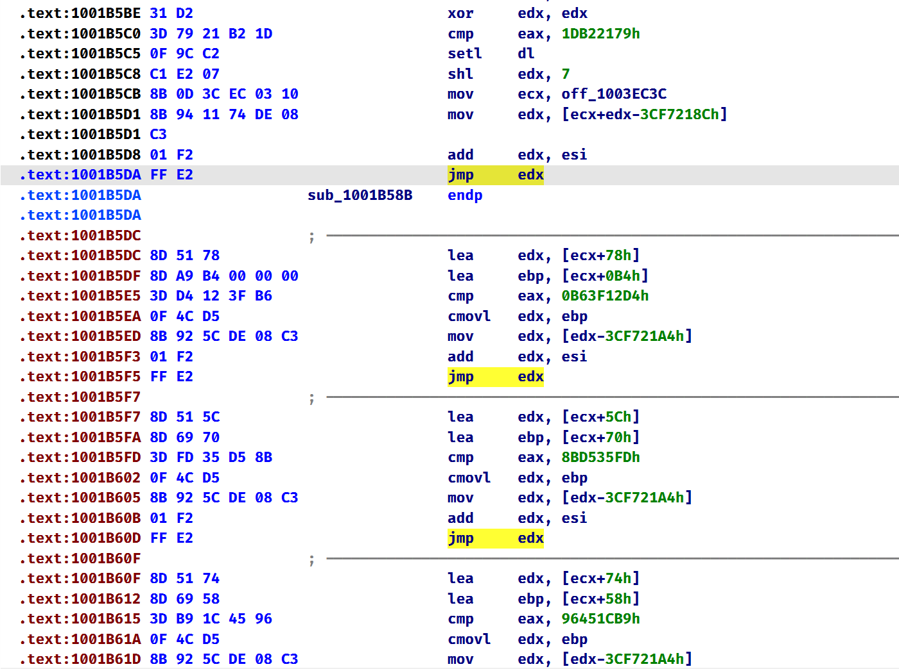

Pattern này là cái dễ nhất, trong 1 chunk sẽ bao gồm cả phép toán cơ bản, đúng 1 phép so sánh và biến đổi đơn giản để tính ra `INDEX` tính địa chỉ.

Case này đơn giản là emu thôi, emu là biết được tại `jcc reg` nhảy đến 2 địa chỉ nào, từ đó dựa trên `Conditional Insn` mà patch lại thành dạng `jcc` gì, ở trường hợp này là `setl` và 1 trong 2 địa chỉ ở ngay dưới nên đặt `jcc` là nhảy đi còn không thì xuống ngay dưới -> sử dụng `jge` thay vì `jl` + `jmp`, số lượng block trong graph-mode sẽ giảm đáng kể. Nếu không tối ưu được thì cứ đóng 2 cái `jcc` + `jmp` vào là xong~~

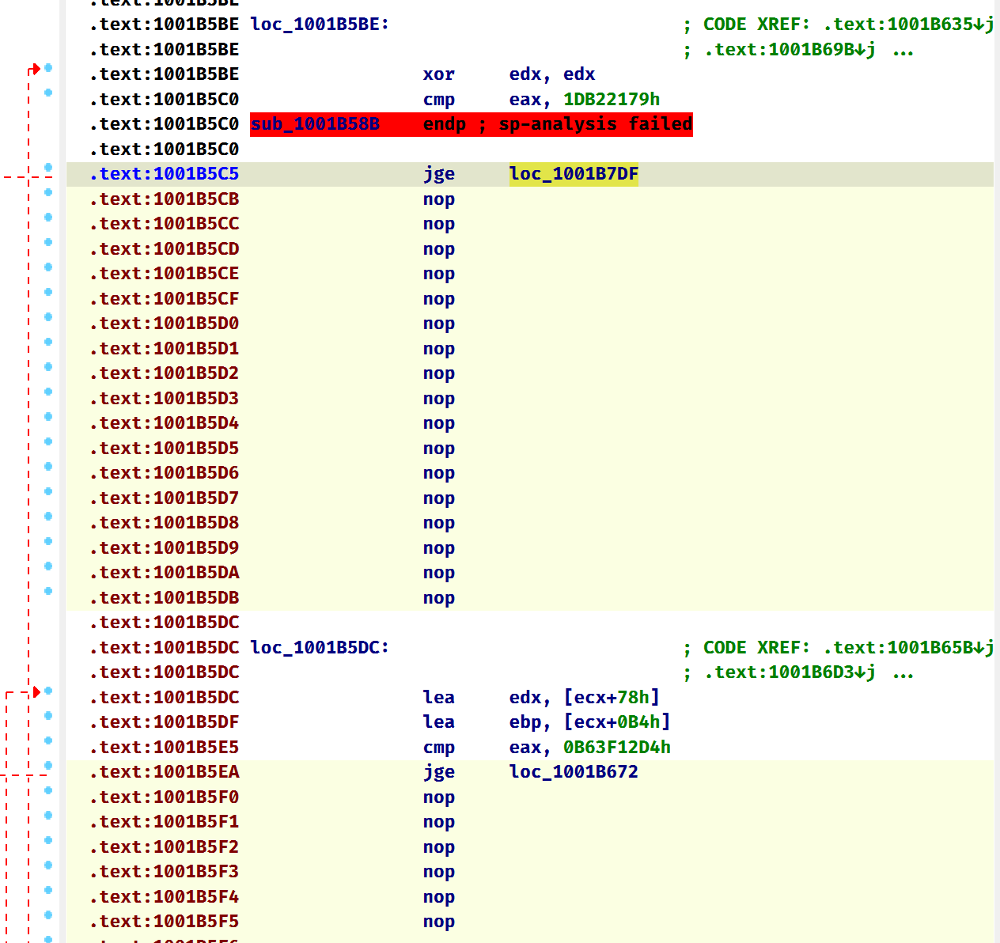

Case này dễ nên không có gì để nói nhiều, còn một lưu ý phát sinh vấn đề khá quan trọng trong quá trình mình làm đó là không được xóa toàn bộ đống byte sau insn kiểm tra để patch.

Như trường hợp dưới đây, mọi thứ khá clean, sau khi `Unicorn` xác định được 2 địa chỉ được nhảy đến rồi thì thực hiện patch. Nhưng nếu ta patch đoạn bộ và sửa thành thuần jmp thì chắc chắn chương trình sẽ lỗi.

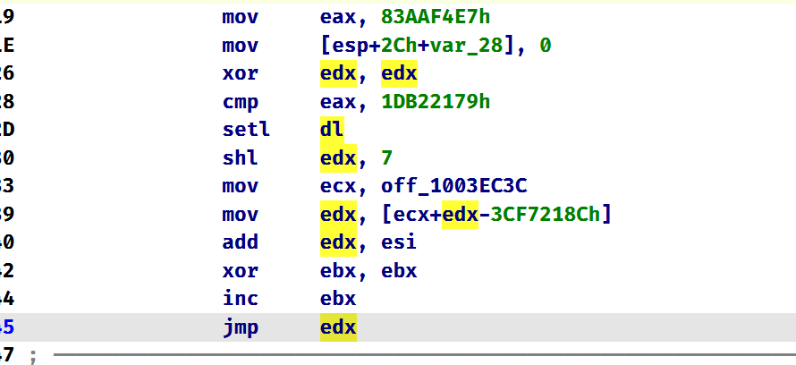

Nguyên nhân là ở đây ngoài indirect jump ra thì còn chứa 1 phần code thật nữa

```asm
xor ebx, ebx
inc ebx
```

Vậy nên script cần xác định các thành phần `TABLE` và `INDEX` như mình nói ở trên là vì thế, những thứ không liên quan tới Indirect jump trong block đều phải giữ lại, chỉ patch bỏ những insn thao tác với 2 thành phần đó thôi. Đoạn này ta sẽ deobf được thành:

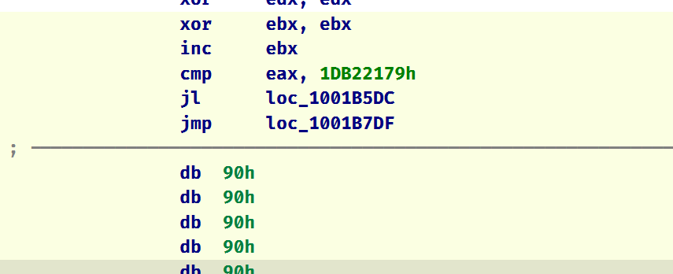

### Pattern multiblock

Thực ra pattern này cũng dễ, cũng ngang pattern trên khi mọi thứ đều rõ ràng, còn không phải check `Conditional Insn` nữa vì nó xác định hết rồi

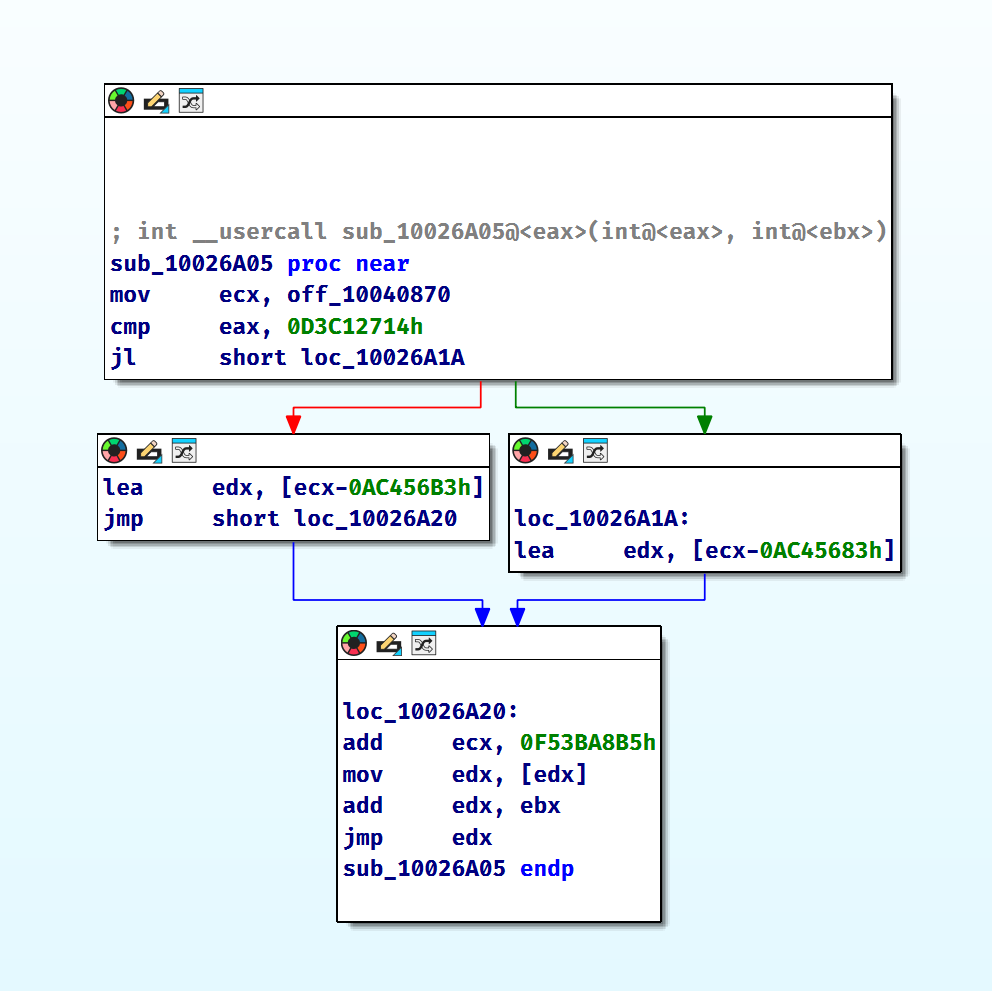

Tuy nhiên sẽ mất công viết thêm đoạn xác định các block vì chúng không nằm liền nhau :v.

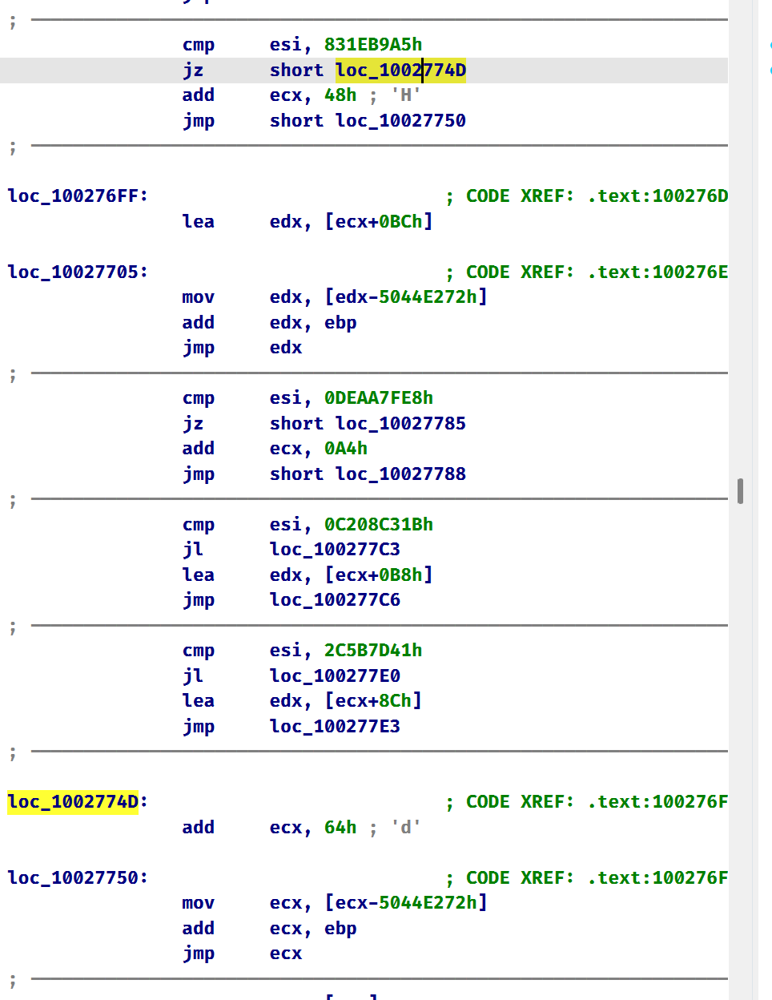

Ở pattern này thì việc kiểm soát số lượng byte khá quan trọng, đôi khi không đủ byte thì nên thêm cái trampoline vào block rộng hơn rồi patch cho thoải mái.

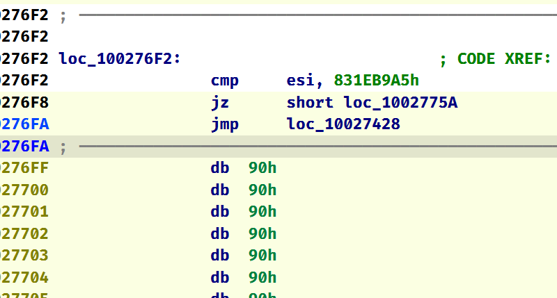

### Pattern trọc

Cái pattern này thiểu năng vcl, chả có cgi. Thực ra deobf cũng dễ nhưng vì chương trình mình thấy chả bao h chạy vào nên thôi cũng không code thêm `handler` cho pattern này. Nêu ý tưởng thôi ai làm thì làm.

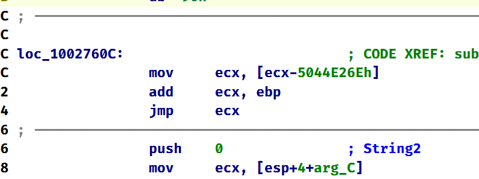

Ý tưởng vẫn cực đơn giản, mặc dù trông chả có gì để emu bắt được, nhưng vẫn là như trên, bám theo `TABLE` và `INDEX`. Tuy nhiên ở đây ta không có thấy `CMP` hay gì cả, vậy thì đơn giản là kéo hết các trường hợp ra thôi.

Mình có từng chứng minh bằng script thì ebp sẽ có 1 giá trị duy nhất dẫn đến luồng này.

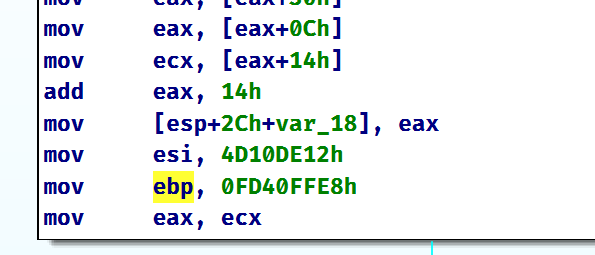

Xác định tương tự với ecx, vì ebp đã chứa const, vậy chắc chắn ecx sẽ chứa `TABLE`, từ đó mà dựng ra 1 chunk if-else thôi.

```
If ecx==a & ebp==b->jmpX else If ecx==c & ebp==d->jmpY....
```

Đơn giản mà đúng không :v

Tuy case này đơn giản và mình cũng chưa gặp biến thể nào khác nên cũng không xác định được rõ ràng, Mình có nghĩ ra vài trường hợp dị dạng mà idea trên thì cũng cần bổ sung. Như `TABLE` chẳng hạn, không chỉ đơn giản là tìm pattern `mov ecx, <direct address>` là được, `TABLE` có thể nó sẽ được mov vào ecx từ 1 thanh ghi khác chứ không truyền trực tiếp như này...Nên để dò ra hết các case thì cũng cần script truy rõ nguồn gốc giá trị trong thanh ghi không là cực kì dễ thiếu sót.

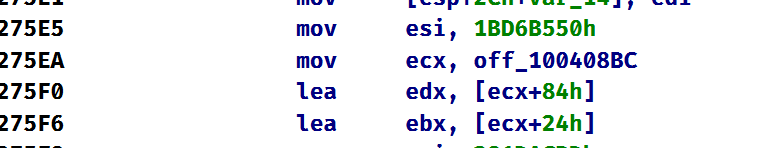

Túm lại là idea ở đó, ai gặp biết thể tự giải quyết phần râu ria chứ không có chuyện 1 shot đâu, bọn ollvm lắm trò lắm.

### Pattern multicmp

Đây cũng là cái pattern dị dạng nhất, mất mình mấy ngày mới nghĩ ra cách solve.

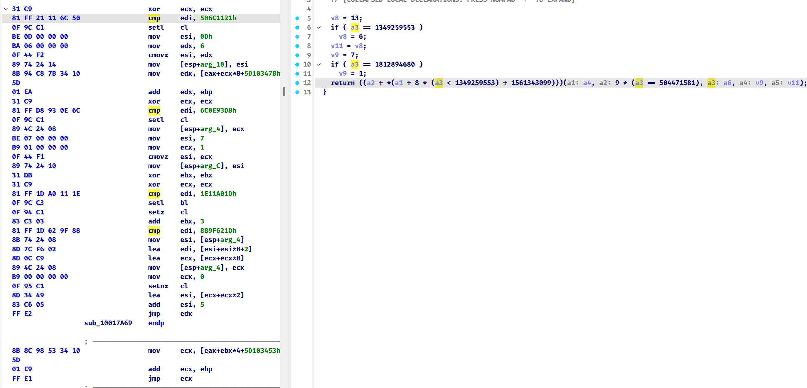

Tuy nhiên sau khi đọc cẩn thận và phân tích kĩ thành phần thì cũng ra hướng deobf. Ở đây nếu chưa động đến thì cái này rất dễ bắt theo pattern của pattern đầu tiên vì cũng mang pattern `CMP -> condition Insn -> Indirect JMP` ở cuối.

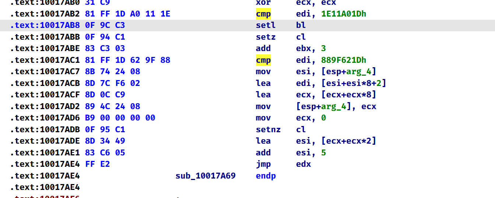

Tuy nhiên nếu các bạn nhìn kĩ thì cái `CMP` ở cuối nó sẽ không liên quan gì đến giá trị dùng để nhảy mà lại phụ thuộc vào cái `CMP` ở đầu cơ.

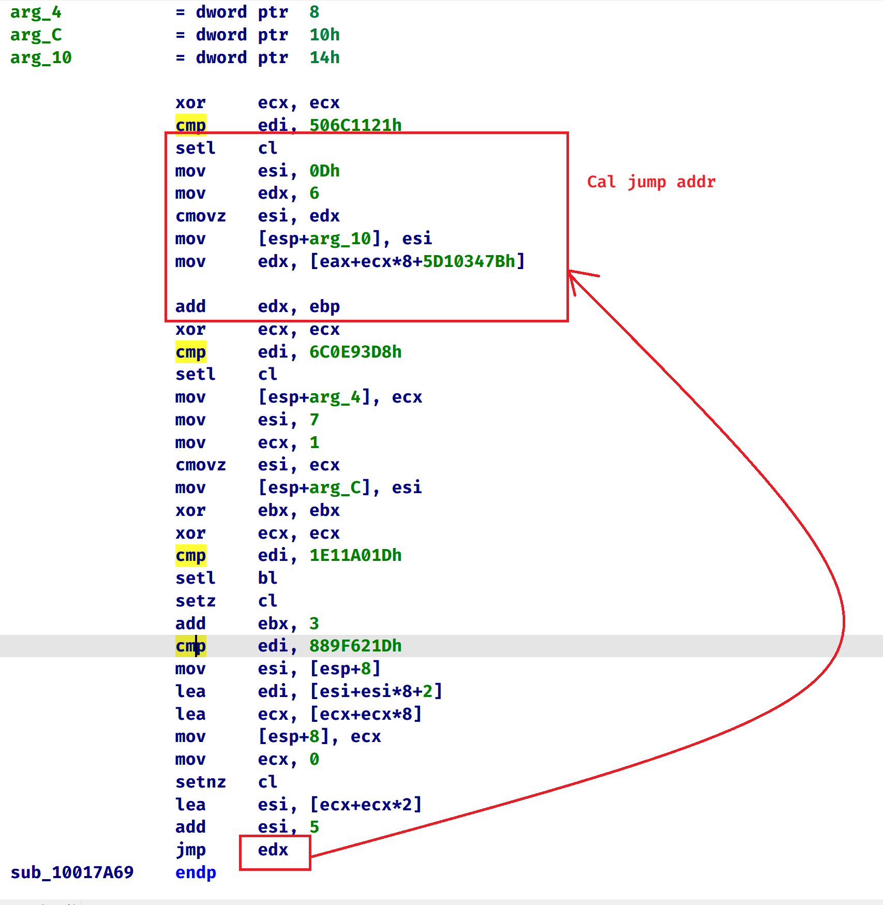

Nên chắc chắn không những pattern cơ bản bắt thiếu mà còn patch sai.

Không chỉ vậy, nếu chỉ đơn giản detect ra `EDX` được biến đổi ở đâu và patch được thì cũng không xử lý được những case sau khi chúng cũng dùng những giá trị bị ảnh hưởng bởi những cái `CMP` khác dưới đó.

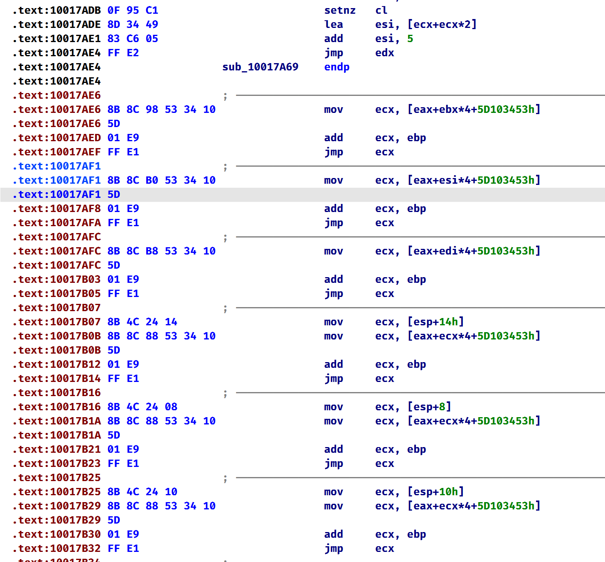

Cách mình giải quyết vẫn là nhắm vào vị trí của các `TABLE` và `INDEX`, ta đơn giản là chia pattern này thành 2 phần, phần cmp và phần Indirect jump.

Quan sát hình trên, ta dễ dàng thấy được eax là `TABLE` rồi, các giá trị `INDEX` đều là giá trị nhân 4 kia.

`Table` vẫn luôn đơn giản.

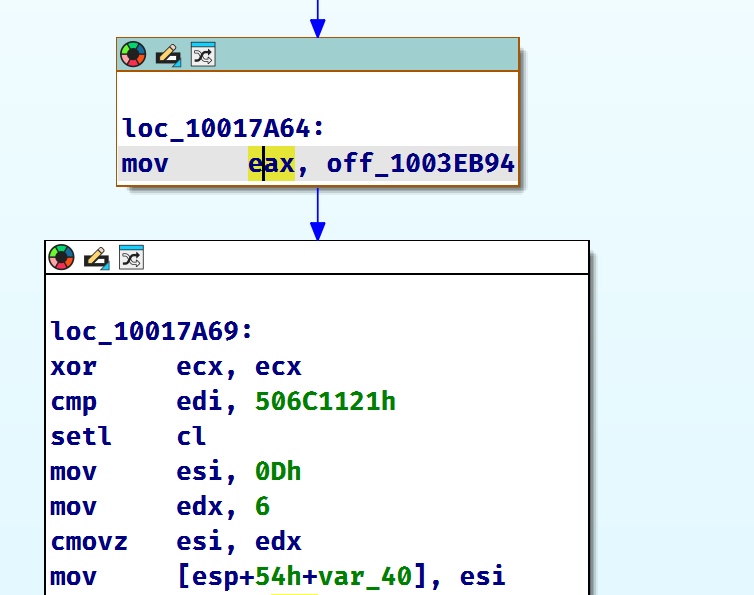

Đối vời từng `INDEX`, dễ dàng map được như sau.

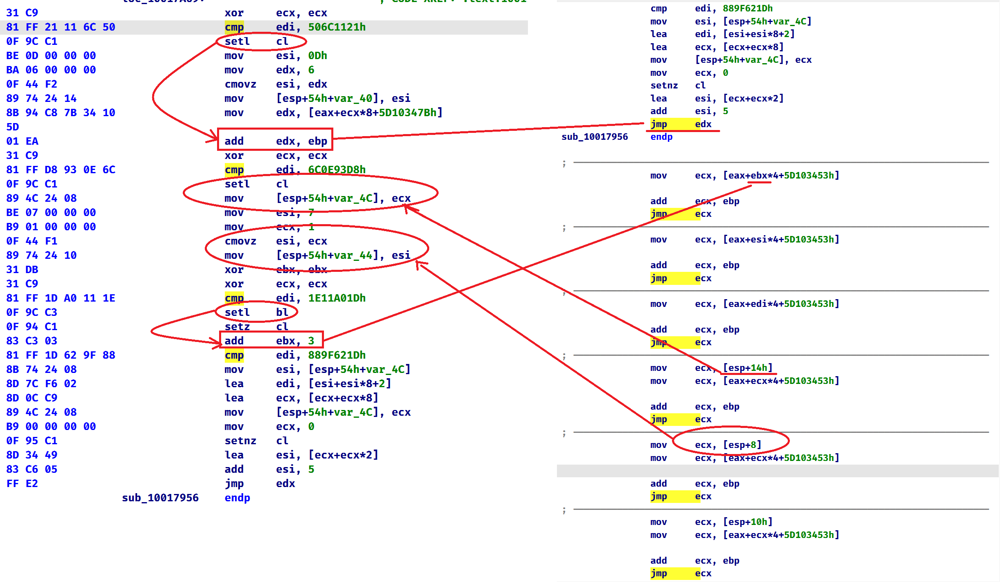

Trông hơi bẩn tưởi, hi vọng mn nhìn mà hiểu(những biến stack tương ứng trỏ từ esp, quên không undef đi nên nhìn hơi khó, lười vẽ lại nên cứ vậy đi :v). Căn bản là mỗi giá trị `INDEX` đều được biến đổi dựa trên 1 giá trị thay đổi bởi thanh ghi ảnh hưởng từ một `Condition Insn` và giá trị đó dùng để tính `INDEX`.

Từ đó xác định được cách patch, Vẫn là emu ra 2 địa chỉ được nhảy đến, dựa trên giá trị được thay đổi từ `INDEX`. Sau đó là check giá trị trong `INDEX` vốn được dùng để tính địa chỉ nhảy tới.

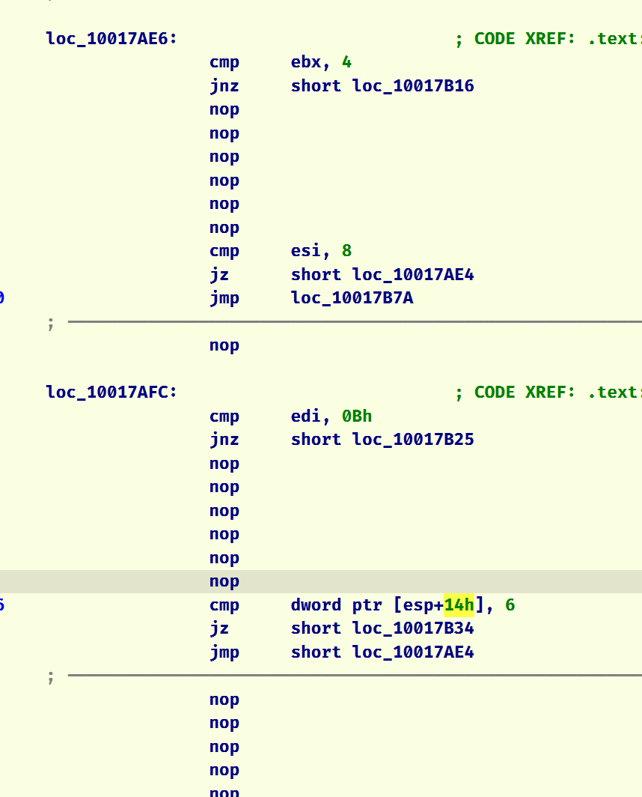

Bởi vốn chúng thay đổi dựa trên biến đổi ở trên nên dễ dàng có được lệnh `jcc` tương ứng. như ở đây esi-`INDEX` của chunk indirect jump này biến đổi từ `setnz`.

```asm
.text:10017AD5 0F 95 C1                          setnz   cl
.text:10017AD8 8D 34 49                          lea     esi, [ecx+ecx*2]
.text:10017ADB 83 C6 05                          add     esi, 5
...
.text:10017AF1 8B 8C B0 53 34 10                 mov     ecx, [eax+esi*4+5D103453h]
.text:10017AF1 5D
.text:10017AF8 01 E9                             add     ecx, ebp
.text:10017AFA FF E1                             jmp     ecx
```

Nên rõ ràng jcc tương ứng là `jz/jnz`, với script của mình thì patch thành như sau.

```asm
.text:10017AF1 83 FE 08                          cmp     esi, 8
.text:10017AF4 74 EE                             jz      short loc_10017AE4
.text:10017AF6 E9 7F 00 00 00                    jmp     loc_10017B7A
```

Tổng thể thì sẽ như này

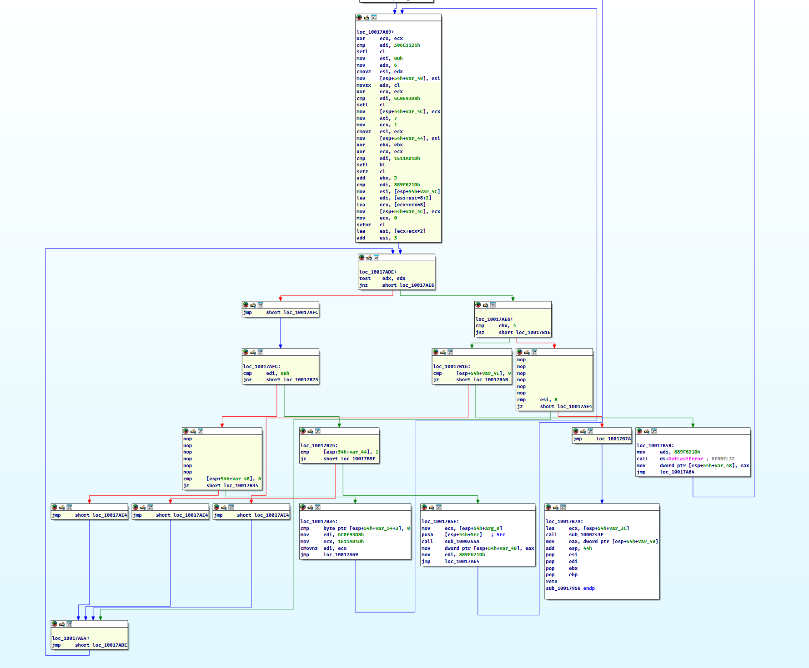

```asm
.text:10017956                   var_54          = dword ptr -54h
.text:10017956                   var_50          = dword ptr -50h
.text:10017956                   var_4C          = dword ptr -4Ch
.text:10017956                   var_48          = byte ptr -48h
.text:10017956                   var_44          = dword ptr -44h
.text:10017956                   var_40          = dword ptr -40h
.text:10017956                   var_3C          = dword ptr -3Ch
.text:10017956                   Src             = dword ptr -38h
.text:10017956                   var_2A          = byte ptr -2Ah
.text:10017956                   var_11          = byte ptr -11h
.text:10017956                   var_10          = byte ptr -10h
.text:10017956                   arg_0           = dword ptr  4
.text:10017956                   arg_4           = dword ptr  8
.text:10017956
...
.text:10017A64
.text:10017A64                   loc_10017A64:                           ; CODE XREF: sub_10017956+204↓j
.text:10017A64 A1 94 EB 03 10                    mov     eax, off_1003EB94
.text:10017A69                   loc_10017A69:                           ; CODE XREF: sub_10017956+1F0↓j
.text:10017A69 31 C9                             xor     ecx, ecx
.text:10017A6B 81 FF 21 11 6C 50                 cmp     edi, 506C1121h
.text:10017A71 0F 9C C1                          setl    cl
.text:10017A74 BE 0D 00 00 00                    mov     esi, 0Dh
.text:10017A79 BA 06 00 00 00                    mov     edx, 6
.text:10017A7E 0F 44 F2                          cmovz   esi, edx
.text:10017A81 89 74 24 14                       mov     [esp+54h+var_40], esi
.text:10017A85 0F B6 D1                          movzx   edx, cl
.text:10017A88 31 C9                             xor     ecx, ecx
.text:10017A8A 81 FF D8 93 0E 6C                 cmp     edi, 6C0E93D8h
.text:10017A90 0F 9C C1                          setl    cl
.text:10017A93 89 4C 24 08                       mov     [esp+54h+var_4C], ecx
.text:10017A97 BE 07 00 00 00                    mov     esi, 7
.text:10017A9C B9 01 00 00 00                    mov     ecx, 1
.text:10017AA1 0F 44 F1                          cmovz   esi, ecx
.text:10017AA4 89 74 24 10                       mov     [esp+54h+var_44], esi
.text:10017AA8 31 DB                             xor     ebx, ebx
.text:10017AAA 31 C9                             xor     ecx, ecx
.text:10017AAC 81 FF 1D A0 11 1E                 cmp     edi, 1E11A01Dh
.text:10017AB2 0F 9C C3                          setl    bl
.text:10017AB5 0F 94 C1                          setz    cl
.text:10017AB8 83 C3 03                          add     ebx, 3
.text:10017ABB 81 FF 1D 62 9F 88                 cmp     edi, 889F621Dh
.text:10017AC1 8B 74 24 08                       mov     esi, [esp+54h+var_4C]
.text:10017AC5 8D 7C F6 02                       lea     edi, [esi+esi*8+2]
.text:10017AC9 8D 0C C9                          lea     ecx, [ecx+ecx*8]
.text:10017ACC 89 4C 24 08                       mov     [esp+54h+var_4C], ecx
.text:10017AD0 B9 00 00 00 00                    mov     ecx, 0
.text:10017AD5 0F 95 C1                          setnz   cl
.text:10017AD8 8D 34 49                          lea     esi, [ecx+ecx*2]
.text:10017ADB 83 C6 05                          add     esi, 5
.text:10017ADE
.text:10017ADE                   loc_10017ADE:                           ; CODE XREF: sub_10017956:loc_10017AE4↓j
.text:10017ADE 85 D2                             test    edx, edx
.text:10017AE0 75 04                             jnz     short loc_10017AE6
.text:10017AE2 EB 18                             jmp     short loc_10017AFC
.text:10017AE4
.text:10017AE4                   loc_10017AE4:                           ; CODE XREF: sub_10017956+19E↓j
.text:10017AE4 EB F8                             jmp     short loc_10017ADE
.text:10017AE6
.text:10017AE6                   loc_10017AE6:                           ; CODE XREF: sub_10017956+18A↑j
.text:10017AE6 83 FB 04                          cmp     ebx, 4
.text:10017AE9 75 2B                             jnz     short loc_10017B16
.text:10017AEB 90                                nop
.text:10017AEC 90                                nop
.text:10017AED 90                                nop
.text:10017AEE 90                                nop
.text:10017AEF 90                                nop
.text:10017AF0 90                                nop
.text:10017AF1 83 FE 08                          cmp     esi, 8
.text:10017AF4 74 EE                             jz      short loc_10017AE4
.text:10017AF6 E9 7F 00 00 00                    jmp     loc_10017B7A
.text:10017AFC
.text:10017AFC                   loc_10017AFC:                           ; CODE XREF: sub_10017956+18C↑j
.text:10017AFC 83 FF 0B                          cmp     edi, 0Bh
.text:10017AFF 75 24                             jnz     short loc_10017B25
.text:10017B07 83 7C 24 14 06                    cmp     [esp+54h+var_40], 6
.text:10017B0C 74 26                             jz      short loc_10017B34
.text:10017B0E EB D4                             jmp     short loc_10017AE4
.text:10017B16                   loc_10017B16:                           ; CODE XREF: sub_10017956+193↑j
.text:10017B16 83 7C 24 08 09                    cmp     [esp+54h+var_4C], 9
.text:10017B1B 74 2E                             jz      short loc_10017B4B
.text:10017B1D EB C5                             jmp     short loc_10017AE4
.text:10017B25
.text:10017B25                   loc_10017B25:                           ; CODE XREF: sub_10017956+1A9↑j
.text:10017B25 83 7C 24 10 01                    cmp     [esp+54h+var_44], 1
.text:10017B2A 74 33                             jz      short loc_10017B5F
.text:10017B2C EB B6                             jmp     short loc_10017AE4
.text:10017B34
.text:10017B34                   loc_10017B34:                           ; CODE XREF: sub_10017956+1B6↑j
.text:10017B34 80 7C 24 03 00                    cmp     byte ptr [esp+54h+var_54+3], 0
.text:10017B39 BF D8 93 0E 6C                    mov     edi, 6C0E93D8h
.text:10017B3E B9 1D A0 11 1E                    mov     ecx, 1E11A01Dh
.text:10017B43 0F 45 F9                          cmovnz  edi, ecx
.text:10017B46 E9 1E FF FF FF                    jmp     loc_10017A69
.text:10017B4B
.text:10017B4B                   loc_10017B4B:                           ; CODE XREF: sub_10017956+1C5↑j
.text:10017B4B BF 1D 62 9F 88                    mov     edi, 889F621Dh
.text:10017B50 FF 15 08 50 03 10                 call    ds:GetLastError ; KERNEL32
.text:10017B56 89 44 24 0C                       mov     dword ptr [esp+54h+var_48], eax
.text:10017B5A E9 05 FF FF FF                    jmp     loc_10017A64
.text:10017B5F
.text:10017B5F                   loc_10017B5F:                           ; CODE XREF: sub_10017956+1D4↑j
.text:10017B5F 8B 4C 24 58                       mov     ecx, [esp+54h+arg_0]
.text:10017B63 FF 74 24 1C                       push    [esp+54h+Src]   ; Src
.text:10017B67 E8 EE A9 FE FF                    call    sub_1000255A
.text:10017B6C 89 44 24 0C                       mov     dword ptr [esp+54h+var_48], eax
.text:10017B70 BF 1D 62 9F 88                    mov     edi, 889F621Dh
.text:10017B75 E9 EA FE FF FF                    jmp     loc_10017A64
.text:10017B7A
.text:10017B7A                   loc_10017B7A:                           ; CODE XREF: sub_10017956+1A0↑j
.text:10017B7A 8D 4C 24 18                       lea     ecx, [esp+54h+var_3C]
.text:10017B7E E8 BB A8 FE FF                    call    sub_1000243E
.text:10017B83 8B 44 24 0C                       mov     eax, dword ptr [esp+54h+var_48]
.text:10017B87 83 C4 44                          add     esp, 44h
.text:10017B8A 5E                                pop     esi
.text:10017B8B 5F                                pop     edi
.text:10017B8C 5B                                pop     ebx
.text:10017B8D 5D                                pop     ebp
.text:10017B8E C3                                retn
```

## Tổng kết

Vậy đó là cách xử lý của một vài pattern xuất hiện trong mẫu `PlugX` mà mình deobf, tất nhiên mình không cung cấp script và còn rất nhiều vấn đề râu ria cần xử lý mà phải tự làm mới thấy được.

Hi vọng bài viết này giúp ích gì đó :v.


<div align="center">Author: SonVH</div>
